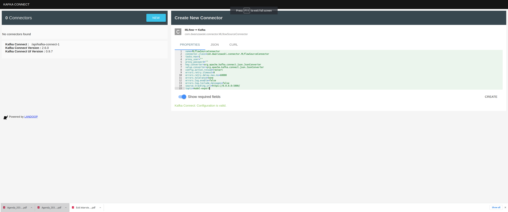
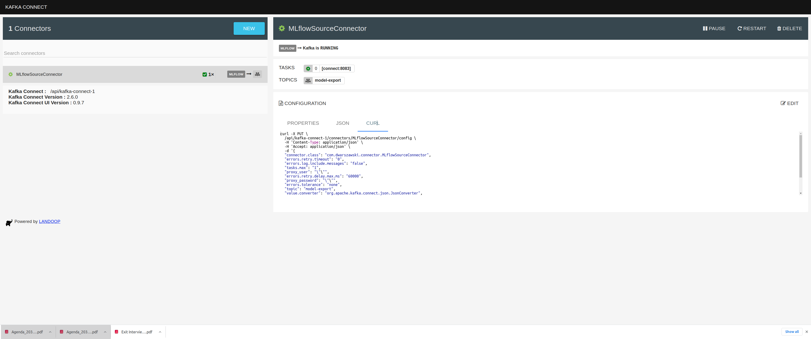
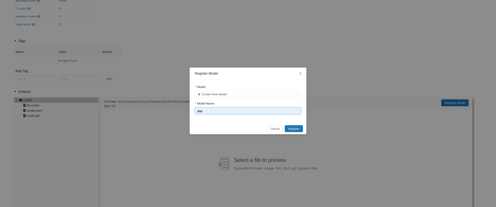
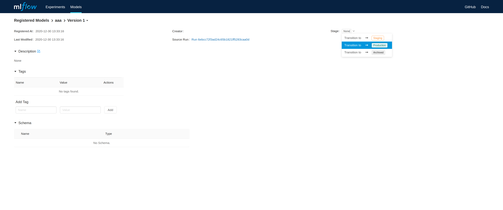

# Kafka Connect MLflow source
> Dedicated Kafka Connector to track changes in `MLflow Model Registry`

## Table of contents
* [General info](#general-info)
* [Local setup](#local-setup)
* [Release](#release)

## General info
Kafka Connector to track model stage changes for configured `MLflow Model Registry` instance.
The purpose is to fetch `ModelRegistry.ModelVersion` which recently change status to `Production` and generate
`Model Export Request` as event on Kafka topic.

<details>
  <summary>Event schema and sample payload of the event</summary>
  
```json
{
  "schema": {
    "type": "struct",
    "fields": [
      {
        "type": "string",
        "optional": false,
        "field": "Name"
      },
      {
        "type": "string",
        "optional": false,
        "field": "Version"
      },
      {
        "type": "int64",
        "optional": false,
        "field": "CreationTimestamp"
      },
      {
        "type": "int64",
        "optional": false,
        "field": "lastUpdatedTimestamp"
      },
      {
        "type": "string",
        "optional": true,
        "field": "userId"
      },
      {
        "type": "string",
        "optional": false,
        "field": "currentStage"
      },
      {
        "type": "string",
        "optional": false,
        "field": "description"
      },
      {
        "type": "string",
        "optional": false,
        "field": "source"
      },
      {
        "type": "string",
        "optional": false,
        "field": "runId"
      },
      {
        "type": "string",
        "optional": false,
        "field": "status"
      },
      {
        "type": "string",
        "optional": true,
        "field": "statusMessage"
      },
      {
        "type": "array",
        "items": {
          "type": "struct",
          "fields": [
            {
              "type": "string",
              "optional": false,
              "field": "Key"
            },
            {
              "type": "string",
              "optional": false,
              "field": "Value"
            }
          ],
          "optional": false,
          "name": "ModelExportRequest"
        },
        "optional": true,
        "field": "tags"
      },
      {
        "type": "string",
        "optional": false,
        "field": "runLink"
      }
    ],
    "optional": false,
    "name": "ModelExportRequest"
  },
  "payload": {
    "Name": "aaa",
    "Version": "1",
    "CreationTimestamp": 1609331596360,
    "lastUpdatedTimestamp": 1609331610766,
    "userId": "",
    "currentStage": "Production",
    "description": "",
    "source": "file:///tmp/test/1/6ebcc72f3ad24c65b1821ff5283caa0d/artifacts/model",
    "runId": "6ebcc72f3ad24c65b1821ff5283caa0d",
    "status": "READY",
    "statusMessage": "",
    "tags": [],
    "runLink": ""
  }
}
```
</details>

## Local setup
Connector is distributed as a `jar` file. In order to build the assembly use `mvn clean install -f ./kafka-connect-mlflow`.
Assembly will be available in directory `./kafka-connect-mlflow/target/kafka-connect-mlflow-${project_version}-assembly.jar`.

Kafka Connect requires Apache Kafka and Apache Zookeeper servers.
There is `docker-compose.yaml` available to run all required components as containers.
Generated `jar` is mounted as the volume in `kafka-connect` container taken directly from `./target` directory.

Additionally, `docker-compose/yaml` contains `kafka-connect-ui` service to setup `kafka-connect-mlflow` instance through browser.
It is exposed on port `8000` by default. 


Connector should now be available through `Kafka Connect UI`:



Creating new instance of connector:


Event can be trigger by registering model version from MLflow Tracking UI:


And changing the stage of the model version to `Production`:



## Release
`Maven` support releases with `maven-release-plugin`.
Release can be generated using two-step procedure:

* Prepare release (use flag `-DdryRun=true` if you want to verify it before creating release)

    `mvn release:prepare -DignoreSnapshots=true   -DskipTests=true -f ./kafka-connect-mlflow/`
    
    two commits will be added on top of your commit and pushed to your branch:
 
    * prepare release kafka-connect-mlflow-${version} with proper tag
    * prepare for next development iteration
    
* Tag pushed in the previous step triggers gitlab ci/cd `deploy` stage which publish your assembly to `artifactory`

* Clean release files after all

    `mvn release:clean -f ./kafka-connect-mlflow/`


